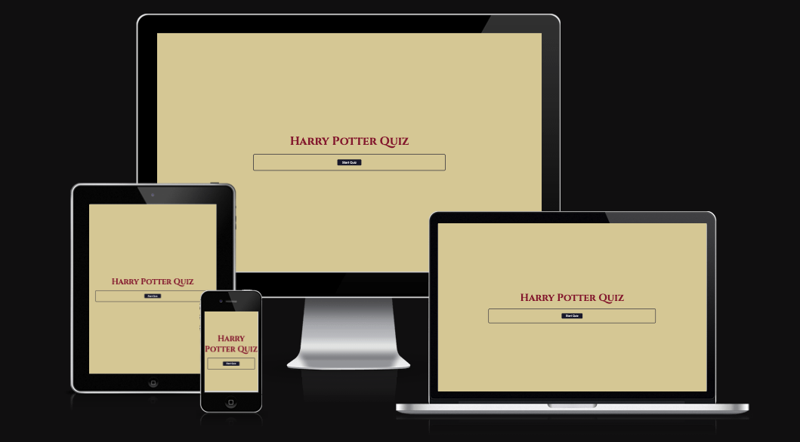
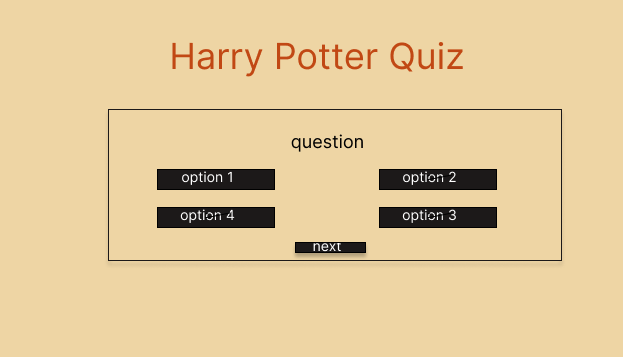
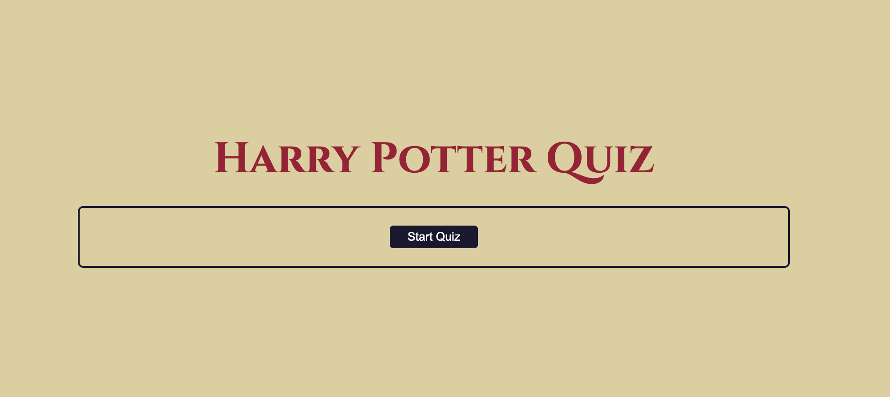
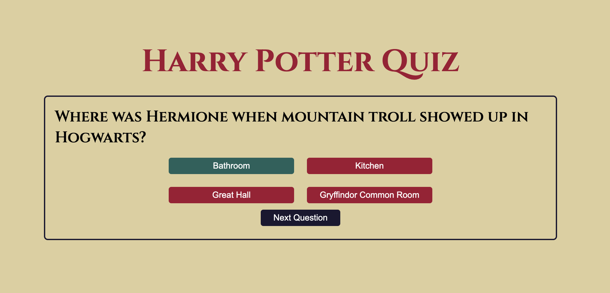
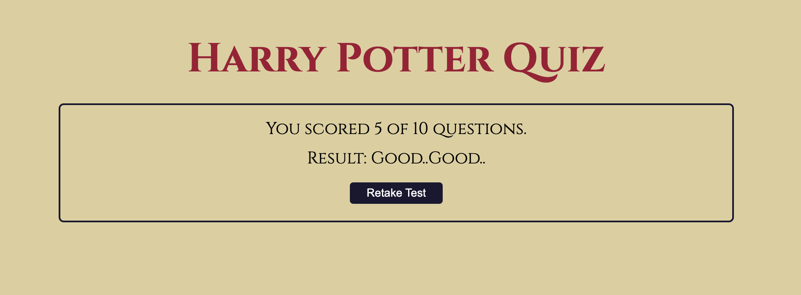
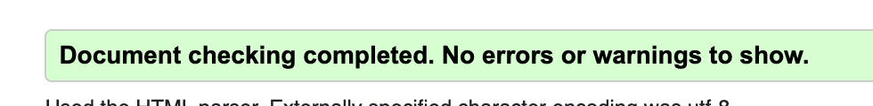
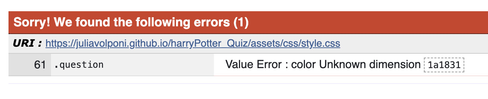
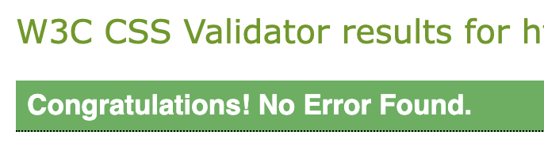

# Harry Potter Quiz 

Welcome to the Harry Potter Quiz! This JavaScript project allows users to test their knowledge of the magical world of Harry Potter by answering a series of questions. Users will be presented with 10 questions and given immediate feedback on their answers. At the end of the quiz, users will see their total points along with a personalized message based on their performance.

[Harry Potter Quiz](https://juliavolponi.github.io/harryPotter_Quiz/)

# User Experience

## User Stories 
* As a first-time user, I want to be able to start the quiz easily.
* As a user, I want immediate feedback on whether my answer was correct or incorrect.
* As a user, I want to see my total points and a message based on my performance at the end of the quiz.

## Wireframe
The wireframe was made on figma with a basic idea of what the quiz needed to look like.

## Design Choices
* ### Tipography
   * The font chosen was 'Cinzel' for the entire document. It falls back to sans-serif respectively.
* ### Colour Scheme
   * The colours chosen is based on Hogwarts/Gryffindor colors. Giving it the aspect of the school, uniform and movie itself.
   

## Features

### The Home Page
The home page of The Quiz displays the sites name as a title and then a container which holds the start quiz button.

### The Game Page
* Answer Questions: After starting the quiz, you will be presented with a series of questions related to the Harry Potter universe. Each question will have four options to choose from. Select the option you believe is the correct answer.

* Immediate Feedback: Once you've selected an answer, the correct answer will be displayed immediately below the question. This allows you to see whether your answer was correct or incorrect right away.

### The Score Page
* Total Points: After answering all 10 questions, your total points will be calculated based on the number of correct answers. You will then see your total points displayed along with a personalized message based on your performance.

* Retake Quiz: If you'd like to retake the quiz, simply click on the "Retake Quiz" button at the end of the quiz. This will restart the quiz, allowing you to test your knowledge again.

### Testing
Based on comprehensive testing, all features of the Harry Potter Quiz project work as intended, providing an easy and straightforward experience for users to achieve their goals. The project has been tested across multiple browsers and screen sizes, ensuring compatibility and responsiveness across various platforms.

## Features Left to Implement
Although the current version of the Harry Potter Quiz project is functional and provides an enjoyable user experience, there are several features that could be implemented in future iterations:

* CSS Styling: Further refine the CSS styling to improve the overall aesthetics and user interface of the quiz, ensuring consistency and coherence with the Harry Potter theme.

* Levels of Difficulty: Introduce different levels of difficulty to the quiz, allowing users to choose between easy, medium, and hard modes. Each level could feature varying degrees of complexit#y in the questions, providing a more challenging experience for seasoned Harry Potter fans.

## Technologies Used
* JavaScript - Add interactivity and dynamic behavior to website.
* HTML5 - provides the content and structure for the website.
* CSS - provides the styling.
* Gitpod - used to deploy the website.
* Github - used to host and edit the website.

## Validator Testing
* HTML
  * No erros were returned when passing through the official W3C validator

* CSS
  * An error was returned when passing through the official(Jigsaw) validator  
  
  Which has been fixed
  

  ## Deployment
* The site was deployed to GitHub pages. The steps to deploy are as follows:
   * In the Github Repository, navigate to the Settings tab
   * From the source section drop-down menu, select the Master Branch
   * Once the master branch has been selected, the page provided the link to the completed website.

The live link to the Github repository can be found here: https://github.com/juliavolponi/harryPotter_Quiz

### To fork repository on Github
A copy of the GitHub Repository can be made by forking the GitHub account. This copy can be viewed and changes can be made to the copy without affecting the original repository. Take the following steps to fork the repository:

1. Log in to GitHub and locate the repository.
2. In the right hand side of the page inline with the repository name is a button called 'Fork', click on the button to create a copy of the original repository in your GitHub Account.

### To create a local clone of this project
1. Under the repository’s name, click on the code tab.
2. In the Clone with HTTPS section, click on the clipboard icon to copy the given URL.
3. In your IDE of choice, open Git Bash.
Change the current working directory to the location where you want the cloned directory to be made.
4. Type git clone, and then paste the URL copied from GitHub.
5. Press enter and the local clone will be created.

## Credits
I would like to express my gratitude to Code Institute for providing high-quality classes that have greatly improved my understanding of JavaScript and programming logic. It's been invaluable in my learning journey. Special thanks to my tutor, Precious Mentor, for the continuous support, guidance, and valuable feedback throughout the development of my projects. 

